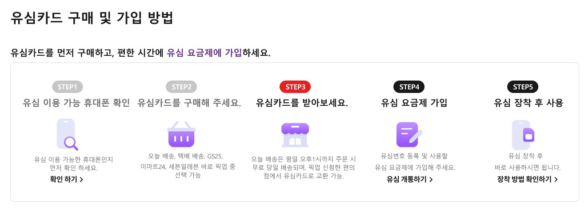

# [코드리뷰]5주차-step

# 20221129(5주차 - step)



```html
<!DOCTYPE html>
<html lang="ko">
  <head>
      <meta name="viewport" content="width=device-width, initial-scale=1">
      <meta charset="UTF-8">
      <title>5주차 - step / 이귀령</title>
  </head>
  <body>
      <div id="wrap">
          <section class="step-wrap">
              <h3>유심카드 구매 및 가입 방법</h3>
              <article>
                  <p class="recommend">유심카드를 먼저 구매하고, 편한 시간에<strong class="puple">유심 요금제에 가입</strong>하세요.</p>
                  <div class="step-box">
                      <!-- 단계의 구분은 prev, ongoing, next -->
                      <!-- 단계에 일일이 클래스를 줄 필요없이 기본, prev, ongoing으로 주는 것도 좋은 방법이다.(너무 많은 클래스를 사용하지 않는 것이 좋다.)-->
                      <ol>
                          <li class="stepbystep prev">
                              <span class="step-num">STEP1</span>
                              <span class="step-tit">유심 이용 가능 휴대폰 확인</span>
                              <p class="step-txt">유심 이용 가능한 휴대폰인지
                                먼저 확인 하세요.</p>
                              <span class="step-icon01 hide-txt">유심 이용 가능 휴대폰 확인</span>
                              <!-- 아이콘은 before나 background로 넣어즐 계획 -->
                              <a href="#1" class="check-btn"><span>확인 하기</span></a>
                              <!-- 꺽쇠는 after선택자로 넣어줌 -->
                          </li>
                          <li class="stepbystep prev">
                              <span class="step-num">STEP2</span>
                              <span class="step-tit">유심카드를 구매해 주세요.</span>
                              <p class="step-txt">오늘 배송, 택배 배송, GS25,
                                이마트24, 세븐일레븐 바로 픽업 중
                                선택 가능</p>
                              <span class="step-icon02 hide-txt">유심카드를 구매해 주세요.</span>
                          </li>
                          <li class="stepbystep ongoing">
                              <span class="step-num">STEP3</span>
                              <span class="step-tit">유심카드를 받아보세요.</span>
                              <p class="step-txt">오늘 배송은 평일 오후1시까지 주문 시
                                무료 당일 배송되며, 픽업 신청한 편의점에서 유심카드로 교환 가능.</p>
                              <span class="step-icon03 hide-txt">유심카드를 받아보세요.</span>
                          </li>
                          <li class="stepbystep next">
                              <span class="step-num">STEP4</span>
                              <span class="step-tit">유심 요금제 가입</span>
                              <p class="step-txt">유심번호 등록 및 사용할
                                유심 요금제에 가입해 주세요.</p>
                              <span class="step-icon04 hide-txt">유심 요금제 가입</span>
                              <a href="#2" class="check-btn"><span>유심 개통하기</span></a>
                          </li>
                          <li class="stepbystep next">
                              <span class="step-num">STEP5</span>
                              <span class="step-tit">유심 장착 후 사용</span>
                              <p class="step-txt">유심 장착 후
                                바로 사용하시면 됩니다.</p>
                              <span class="step-icon05 hide-txt">유심 장착 후 사용</span>
                              <a href="#3" class="check-btn"><span>장착 방법 확인하기</span></a>
                          </li>
                      </ol>
                  </div>
              </article>
          </section>
      </div>
  </body>
</html>
```

## `details` 요소

기본 닫힘 상태로 내부네 삼각형의 레이블이 표시된다.
그리고 `details` 태그의  `open` 속성를 이용해서 열려있는 상태로 기본설정을 할 수 있다.

## 클래스 네이밍

- 클래스를 쓰는 경우에는 두어절을 사용하는 것이 좋다. 너무 짧은 경우에는 겹치는 경우가 생길 수 있기때문이다.
- 사이트의 독자적인 특별한 색상이 있는 경우에도 두어절로 사용하는 것이 좋다.
ex) point-color, color-puple 등등
또는 큰 플젝의 경우 가이드나 기획서를 확인하는 것이 좋으며, 이때 숫자로 표현되기도 한다.
ex) txt_c_1…


## `ol`이냐 `ul`이냐?

-  li의 순서를 바꾸어도 글에 흐름에 지장이 없는 경우는 `ul`, 순서가 중요한 경우는 `ol`(라고 황리더님의 왈)
- 예를 들어 음식 레시피처럼 순서가 바뀌면 안되는 경우(`ol`)

## `menu` 요소

- `menu`의 경우 대화형 항목을 위한 태그이다.
과거에 `menu` 태그 안에 쓰던 `menuitem` 태그는 더이상 사용하지 않는다.
`menu` 태그의 경우에는 편집응용프로그램용 도구모음을 만드는데 사용된다.
    
```html
<menu>
  <li><button onclick="copy()">Copy</button></li>
  <li><button onclick="cut()">Cut</button></li>
  <li><button onclick="paste()">Paste</button></li>
</menu>
```
    
## display:flex 사용시 주의사항

- display:flex;를 사용후 justify-content의 속성을 사용중에 space-around와 space-between 차이는?
- **space-between**은 끝과 끝에 item을 붙여서 사이(between)에 균일한 간격을 만들어준다.
- **space-around**은 item의 둘레(around)에 균일한 간격을 만들어준다. 끝에 붙이지 않고, 중심에서 둘레의 간격을 균일하게 만들어준다.

> 다음과 같이 `space-between`을 사용할 경우 콘텐츠가 완전하게 4개인 경우라는 보장이 없다면 차후 문제가 생길 수 있는 방법입니다.


## gap 속성의 사용

- gap은 행과 열사이의 간격을 설정하는 것으로, flex나 grid에서 지원한다.
  - (다만 flex의 gap의 경우 브라우저에서 지원(맥의 사파리는 14.1이상 부터 지원)된지 비교적 최근이여서 추천하지 않습니다.)

## Step에서 완료, 현재처리중인 부분에 대한 클래스 정리

주체가 어디냐에 따라서 완료/현재진행중인 부분 대한 클래스가 정해집니다.
아래 샘플예제에서 클래스명은 "ux-"만 다를뿐 차이는 없습니다. 
"ux-"는 스크립트에서 제어하는 영역에 대한 그룹원끼리의 약속일 뿐입니다.

주체가 개발여서 코드상에서 클래스가 어떤 역할인지 설명 추가
(보통 대부분은 개발단에서 처리하기 때문에 첫번째 예제처럼 사용하셔도 무방합니다.)

```html
// complated : 완료된 부분
// current : 현재처리중인 부분
<ol>
    <li class="complated"></li>
    <li class="complated"></li>
    <li class="current"></li>
    <li class=""></li>
</ol>
```

개발소스에서라면 대충 이런식에 if문으로 하거나요(가정입니다)
```php
<?php
<ol>
    if ( complated ) {
        <li class="complated"></li>
    } elseif ( current )  {
        <li class="current"></li>
    } else {
        <li class=""></li>
    }
    <li class="complated"></li>
    <li class="complated"></li>
    <li class="current"></li>
    <li class=""></li>
</ol>
?>
```


주체가 프론트엔드개발여서 API를 이용해서 관련 데이터를 가져와서 제어하는 경우

```html
// complated : 완료된 부분
// current : 현재처리중인 부분
<ol>
    <li class="ux-complated"></li>
    <li class="ux-complated"></li>
    <li class="ux-current"></li>
    <li class=""></li>
</ol>
```    

## 가상요소를 이용해서 content counter 만들기

CSS를 이용해서 list-style-type를 숫자 및 다양한 형태로 추가할 수 있습니다.

```html
<dl>
    <dt>How much wood would a wood chuc if a wood chuck could chuck wood?</dt>
    <dd>1,000,000</dd>
    <dt>What is the air-speed velocity of an unladen swallow?</dt>
    <dd>What do you mean? An African or European swallow?</dd>
    <dt>Why did the chicken cross the road?</dt>
    <dd>To get to the other side</dd>
</dl>
```
```css
.faq {
  counter-reset: my-badass-counter;
}
.faq dt:before {
  content: counter(my-badass-counter);
  // list-type을 추가하면 별도로 지정할 수 있습니다.(하단 설명)
  content: counter(my-badass-counter, decimal-leading-zero) ". "; //01, 02..
  counter-increment: my-badass-counter;
}
```